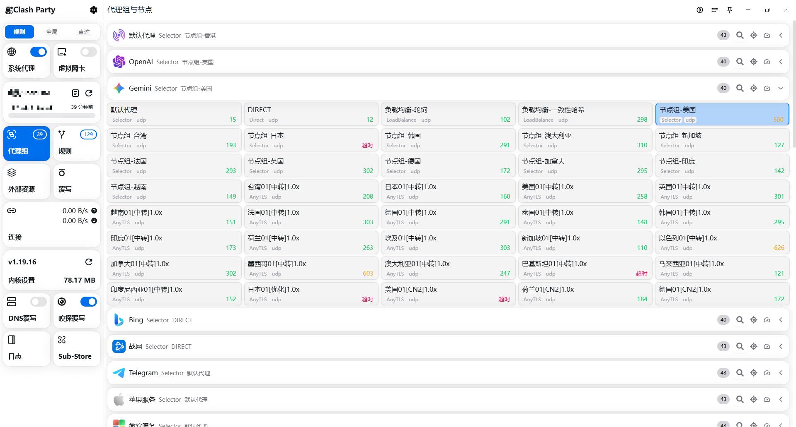
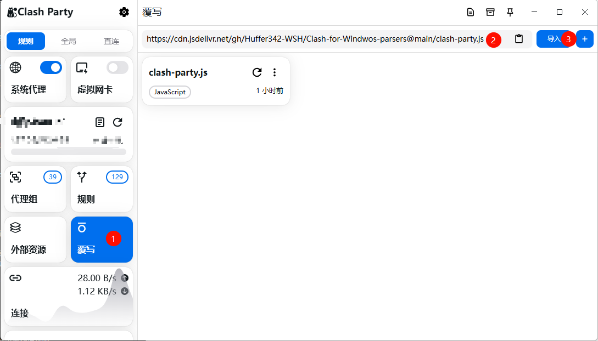
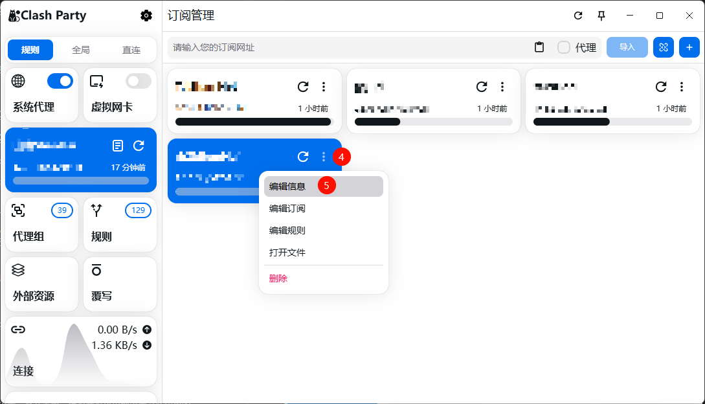
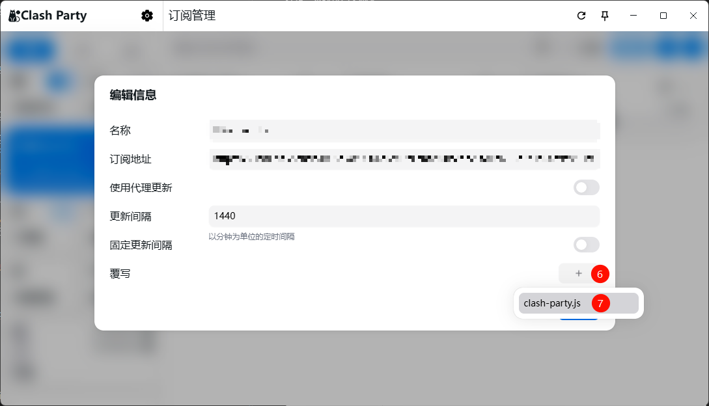
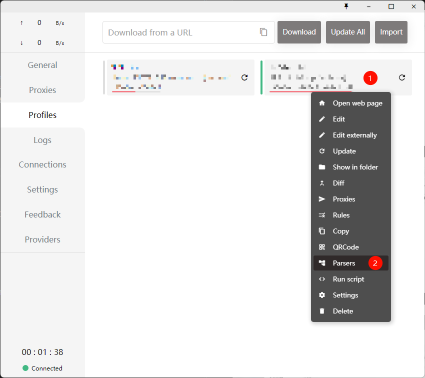
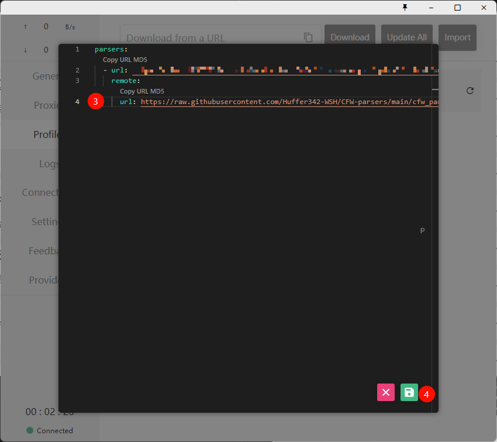

# 主要功能

- 配置DNS
- 为OpenAI、Gemini等设置分流规则
- 为每个国家都设置节点组



# Clash-Party覆写脚本

## 使用方式

选择一个链接导入脚本

```
https://cdn.jsdelivr.net/gh/Huffer342-WSH/Clash-for-Windwos-parsers@main/clash-party.js
```

```
https://raw.githubusercontent.com/Huffer342-WSH/CFW-parsers/refs/heads/main/clash-party.js
```







# ~~Clash-for-Windwos 配置文件预处理（Parsers）~~

    Clash可以通过配置文件设置DNS、流量分流等。Clash会根据配置文件中的rules部分，将不同域名或者进程的流量分配到不同的节点或者节点组。参考资料[Clash知识库-Rules 规则](https://clash.wiki/configuration/rules.html)

默认的配置文件往往不尽人意，不过CFW(Clash for Windwos)提过了配置文件预处理(Parsers)功能，可以通过YMAL或者JavaScript对下载后的配置文件进行[预处理](https://docs.gtk.pw/contents/parser.html)。

## 使用方式

共有三种使用方式：parsers.remote（推荐）、parsers.code、parsers.file。

### parsers.remote

- 右键选择点击Parsers
- 粘贴以下内容，`https://example.com/profile.yaml`替换为订阅链接

```yaml
parsers:
  - url: https://example.com/profile.yaml
    remote:
      url: https://cdn.jsdelivr.net/gh/Huffer342-WSH/Clash-for-Windwos-parsers@main/cfw_parser.js
      cache: true
```





# 脚本概述

本人并不会js，全是问AI的...

## 1. CFW/Clash-Party通过JavaScript预处理文件的实现方法

Clash的配置文件时YAML格式的，YAML是一种类JSON的数据序列化格式，里面就三种结构，键值对、列表、嵌套结构：

1. 键值对：以冒号分隔键和值。

   ```yaml
   name: ChatGPT
   age: 3
   ```
2. 列表：使用短横线（-）表示列表项。

   ```yaml
   fruits:
     - apple
     - banana
     - cherry
   ```
3. 嵌套结构：通过缩进表示嵌套的结构。

   ```yaml
   person:
     name: Alice
     age: 30
     address:
       street: 123 Maple Street
       city: Springfield
   ```

下面是CFW提供的方法模板，可以看到该方法将 `raw`从 YAML 格式解析为 JavaScript 对象 `config`，然后再将其转换回 YAML 字符串并返回。我们只需要修改变量 `config` 就可以了。

```js
module.exports.parse = async (raw, { axios, yaml, notify, console },name, url, interval, selected }) => {
  const config = yaml.parse(raw)
  //添加我们的代码
  return yaml.stringify(config)
}
```

Clash-Party则更加简单

```js
function main(config) {
    //添加我们的代码
    return config;
}

```

## 2. 如何通过变量config访问YAML中对应的元素

```yaml
dns:
  enable: true
  ipv6: true
  default-nameserver:
    - 223.5.5.5
    - 119.29.29.29
    - 114.114.114.114
  enhanced-mode: fake-ip
  fake-ip-range: 198.18.0.1/16
  use-hosts: true
  nameserver:
    - 114.114.114.114
    - https://cloudflare-dns.com/dns-query
    - https://dns.google/dns-query
```

上文是YAML文件的一部分，比如说我想要修改默认的DNS服务器，可以看到 `nameserver`是一个数组，是属于 `dns`的一个属性。因此我们在JavaScript中访问这个数组可以使用点也可以使用方括号，就像python中访问字典中的的键值对一样

```js
    config["dns"] = {
        enable: true,
        ipv6: true,
        "enhanced-mode": "fake-ip",
        "fake-ip-range": "198.18.0.1/16",
        "default-nameserver": ["223.5.5.5", "119.29.29.29", '114.114.114.114'],
        "nameserver": ['https://doh.pub/dns-query', 'https://dns.alidns.com/dns-query'],
        "fallback": ['https://dns.cloudflare.com/dns-query', 'tls://1.1.1.1:853', 'tls://8.8.8.8:853'],
        "fallback-filter": {
            geoip: true,
            ipcidr: ['240.0.0.0/4', '0.0.0.0/32']
        }
    };
```

## 3. 获取节点名称

属性 `proxies`是一个数组，其中每一个元素对应一个节点，我们需要得到元素的 `name`属性，用于新建节点组和规则。

```js
const proxiesRAW = config.proxies.map(proxy => proxy.name);
```

这一行代码的作用是从 `config.proxies` 数组中提取出每个代理对象的 `name` 属性，并将这些名称存储到新的数组 `proxiesRAW` 中

## 4. 筛选节点

```js
const proxiesUseful = proxiesRAW.filter(proxy => {
        return !proxy.includes('剩余') && !proxy.includes('套餐') && !proxy.includes('网址') && !proxy.includes('客服');
    });
const proxiesChatgpt = proxiesUseful.filter(proxy => !proxy.includes('香港')); //GPT节点组排除香港

```

`filter` 方法会对数组中的每个元素（在这里是 proxy）执行一次提供的函数，如果函数返回 true，则保留该元素；如果返回 false，则过滤掉该元素。
上文的代码根据将节点名称筛选出了两个数组。

## 5. 新建节点组

```js
const proxyGroup_ChatGPT = {
    name: 'chatgpt',
    type: 'select',
    proxies: [...proxiesChatgpt]
};
config['proxy-groups'].splice(1, 0, proxyGroup_ChatGPT);
```

按照YAML中的格式，新建一个变量，然后插入到 `config`的 `proxy-groups`属性就行。

## 6. 添加规则

同理，将字符串作为数组元素，插入到 `config['rules']`就行。
我选择了直接替换所有规则，详见[cfw_parser.js](./cfw_parser.js)

## 致谢

[@Loyalsoldier/clash-rulest](https://github.com/Loyalsoldier/clash-rules)
